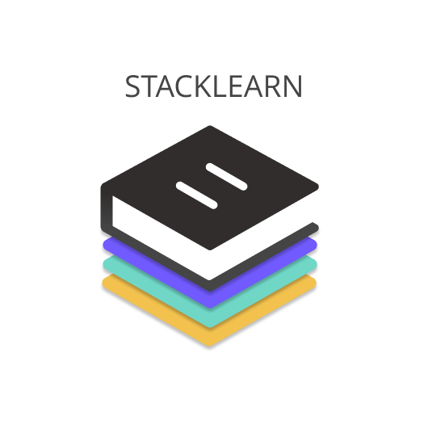

# Stack Learn

Esse projeto consiste em um site voltado para uma empresa de cursos online, chamada *Stack-Learn* com a venda de cursos em geral, voltados desde ENEM, idiomas, profissionalizantes, até vestibulares, possuindo um ambiente virtual acessível a todos os tipos de usuários e com intuito de facilitar cada vez mais o aprendizado das pessoas em diversas áreas.

# Artefatos do Projeto
* [Documento de visão](https://github.com/PI-InfoWeb-CNAT/Stack-Learn/blob/main/docs/Documento_de_Visao.md)
* [Diagrama de casos de uso](https://github.com/PI-InfoWeb-CNAT/Stack-Learn/blob/main/docs/imagens/casos_de_uso.png)
* [Mapa do Site](https://github.com/PI-InfoWeb-CNAT/Stack-Learn/blob/main/docs/imagens/mapa_site_stack_learn.png)
* [Protótipos](./docs/PrototiposSite/)
* [Protótipos Figma](https://www.figma.com/proto/C0ejgynYKpfcMSFLk3SurC/layout?node-id=194%3A359&scaling=scale-down-width&page-id=113%3A60&starting-point-node-id=194%3A359&show-proto-sidebar=1)

* Diagrama de classes de domínio

* Documento de Requisitos

* Detalhamento de casos de uso | administrador

  1. [Gerenciar cursos](./docs/detalhamento_de_caso_de_uso/administrador/crud_cursos.md)

  2. [Gerenciar categorias de cursos](./docs/detalhamento_de_caso_de_uso/administrador/crud_categorias.md)

  3. [Remover alunos](./docs/detalhamento_de_caso_de_uso/administrador/remover_alunos.md)
  
  4. [Remover professores](./docs/detalhamento_de_caso_de_uso/administrador/remover_professores.md) 

* Detalhamento de casos de uso | usuário sem login

  1. [Realizar cadastro](./docs/detalhamento_de_caso_de_uso/usuario_sem_login/realizar_cadastro.md)
  
  2. [Visualizar cursos](./docs/detalhamento_de_caso_de_uso/usuario_sem_login/visualizar_cursos.md)

* Detalhamento de casos de uso | aluno
  
  1. [Revisar dados cadastrais](./docs/detalhamento_de_caso_de_uso/aluno/revisar_dados_cadastrais.md)
   
  2. [Visualizar cursos](./docs/detalhamento_de_caso_de_uso/aluno/visualizar_cursos.md)
   
  3. [Realizar cadastro](./docs/detalhamento_de_caso_de_uso/usuario_sem_login/realizar_cadastro.md)
  
  4. [Realizar a compra de um curso]
  
  5.[Adicionar ou remover cursos ao carrinho de compras]
  
  6.[Verificar o andamento do curso]
  
  7.[Avaliar/Comentar o curso]

* Detalhamento de casos de uso | professor
  
  1. [Revisar dados cadastrais](./docs/detalhamento_de_caso_de_uso/aluno/revisar_dados_cadastrais.md)
  
  2. [Realizar o cadastro e login no site professor]

* [Diagrama de classes de domínio]

* Documentação da arquitetura

### Equipe:

| [ George Azevedo](https://github.com/gasilvabr) |  [ Elízia Regina](https://github.com/Elizia-Olivr) |  [ Matheus Henrique](https://github.com/Matheus07Henrique) | [ Pedro Varela](https://github.com/Pedrohsv1) | [ Ramon Matheus](https://github.com/Ramon-Mateus) | [ Raquel Garcia](https://github.com/raquelgarciaa) | [ Vinícius César](https://github.com/Vinithecsar) | 
| :---: | :---: | :---: | :---: | :---: | :---: | :---: |

