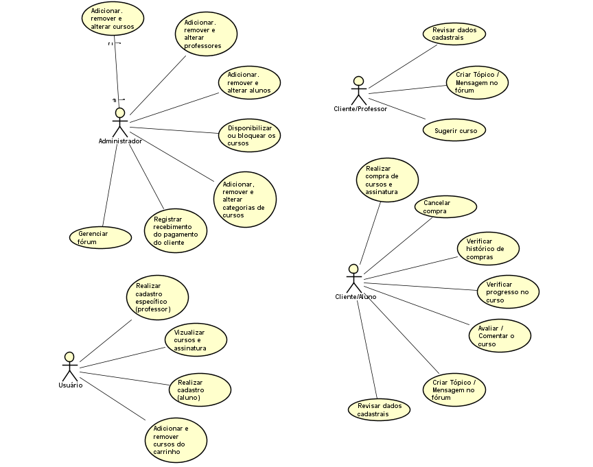
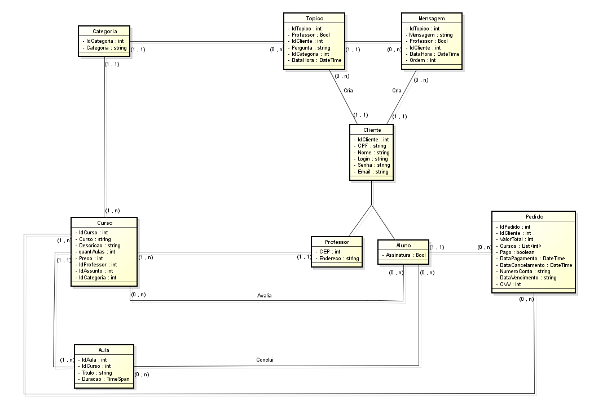

# Diagramas

## Comércio Eletrônico

### Histórico da Revisão 

|  Data  | Versão | Descrição | Autor |
|:-------|:-------|:----------|:------|
| 13/06/2022 | **1.00** | Versão Inicial  | Ramon de Oliveira, Matheus Henrique, Pedro Henrique, Raquel Garcia, Vinícius César, Elízia Regina |

## 1. Diagrama de casos de uso 

## 2. Diagrama de entidades e relacionamentos

